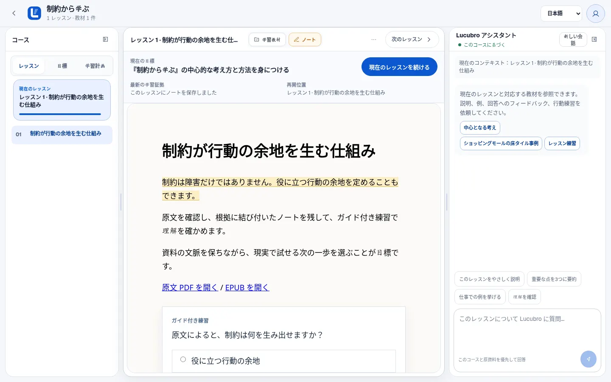
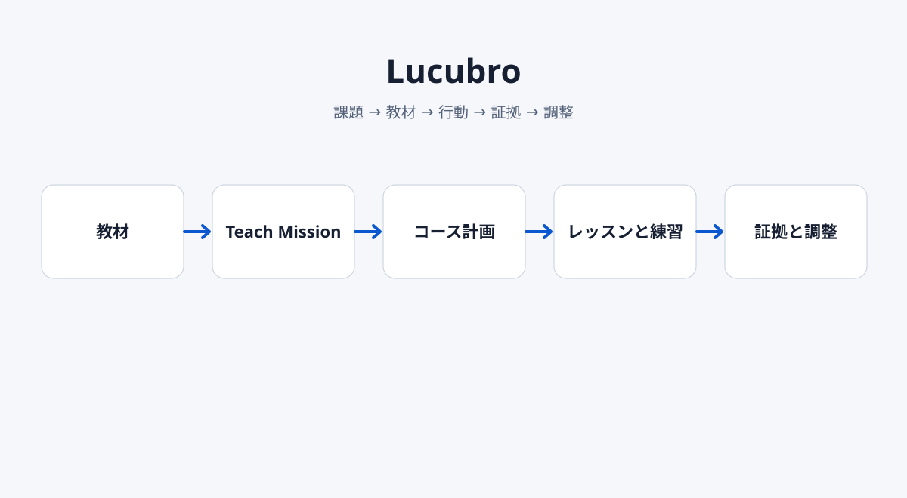
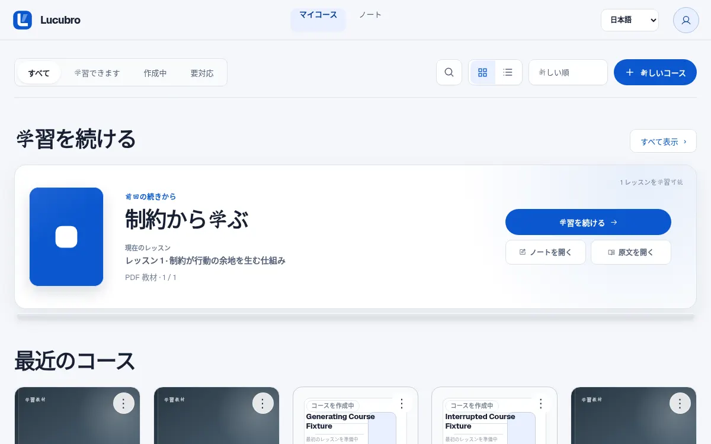
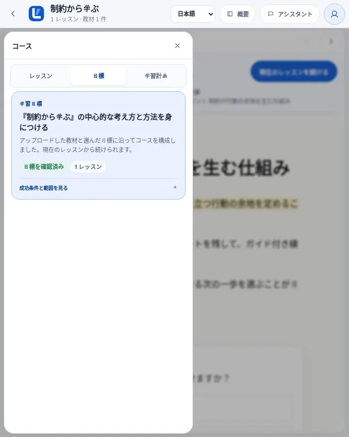
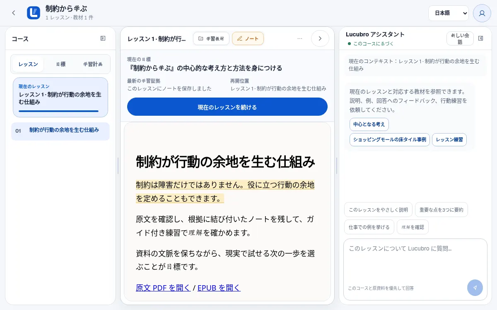
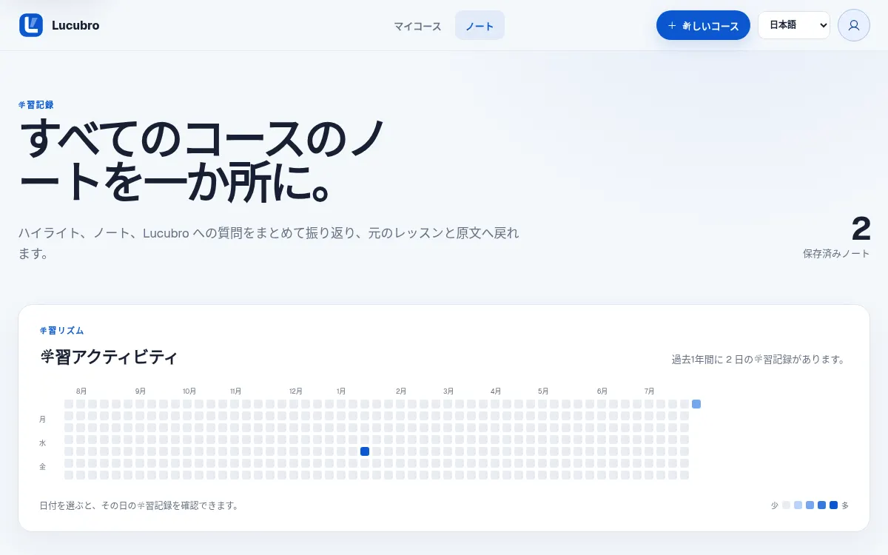

<div align="center">
  

# Lucubro

**手元の教材を、達成したいことに沿ったコースへ変えます。**

[English](README.md) · [简体中文](README.zh-CN.md)<br>
[サンプルを試す](#サンプルを試す)

[](https://github.com/Sebastianhayashi/lucubro/actions/workflows/ci.yml)
[](package.json)
[](LICENSE)
</div>

<!-- section:hero -->



Lucubro は書籍、教科書、記事、過去問、自分の文書をローカルな学習ワークスペースに変えます。先に達成したい成果を決めると、教材を Teach Mission、コース経路、対話的なレッスン、練習、ノート、原文に基づく支援、継続できる学習記録へ整理します。

<!-- section:journey -->

## 90 秒で分かる学習の流れ


1. EPUB、PDF、Markdown、テキストをアップロードします。
2. 教材を使って何を達成したいか確認します。
3. 最初のレッスンを開き、実際の練習に取り組みます。
4. ノート、原文、フィードバック、正確な再開位置を一つの場所に残します。

基本のループは次の通りです。

```text
課題 → 教材 → 行動 → 証拠 → 調整
```

<!-- section:difference -->

## Lucubro の違い

Lucubro は空のチャット画面ではなく、学習ワークスペースです。左に目標と目次、中央に現在のレッスンと練習、右に教材に基づく支援を置きます。現在の学習ストリップは、目標、一つの次の行動、最新の証拠、正確な再開位置だけを示し、二つ目の進捗モデルを作りません。

<!-- section:sample -->

## サンプルを試す

```bash
git clone https://github.com/Sebastianhayashi/lucubro.git
cd lucubro
npm ci
npm run demo:seed
LUCUBRO_DATA_DIR=tests/.runtime/courses PORT=3107 npm start
```

`http://localhost:3107/app?sample=1` を開きます。サンプルワークスペースは `data/courses` から分離され、モデル呼び出しは不要です。

<!-- section:how -->

## 仕組み



Lucubro は教材構造を抽出し、Teach Mission を確認してから、検証済みのレッスンを一つずつ生成します。ノートと練習の試行は学習証拠として記録されます。生成に失敗しても、アップロード済み教材と確認済み目標は回復に使えます。

詳しくは[プロダクト](docs/PRODUCT.md)、[ワークフロー](docs/WORKFLOW.md)、[アーキテクチャ](docs/ARCHITECTURE.md)を参照してください。

<!-- section:surfaces -->

## プロダクト画面

| 画面 | 確認できること |
| --- | --- |
|  | 前回のコースとレッスンから正確に再開できます。 |
|  | コースが見える目標と教材に結び付いています。 |
|  | 学習には行動と明確なフィードバックがあります。 |
|  | ノートと原資料を文脈の中で確認できます。 |

<!-- section:limits -->

## ローカルデータと現在の制約

Lucubro は実験的なオープンソース製品で、ホスト型 SaaS ではありません。

- コースデータは設定したデータディレクトリに保存されます。
- 実際の生成には、インストールと認証を済ませた `kimi` CLI が必要です。
- 本番アカウント、複数ユーザー権限、課金、クラウドキュー、水平スケーリングは現在の範囲外です。
- 生成は非決定的で、構造検証、品質ゲート、ブラウザ旅程によって保護されています。
- PDF と EPUB は、より広い実ファイル互換性マトリクスが必要です。

導入評価の前に[制約](docs/LIMITATIONS.md)を確認してください。

<!-- section:quality -->

## アーキテクチャと品質

```bash
npm run check
npm test
npx playwright test
npm run verify:readme
```

Node 契約テストと Playwright 旅程は、ランディング、ライブラリ、コース作成、生成状態、学習ワークスペース、ノート、原文表示、モバイルドロワー、状態整合性、reduced motion、重要ルートのアクセシビリティを対象にします。[品質](docs/QUALITY.md)と[ベースライン](docs/BASELINE.md)も参照してください。

<!-- section:governance -->

## コントリビューション、セキュリティ、ライセンス

実際の教材 fixture、アクセシビリティとモバイル改善、学習証拠の実験、ノートと原文表示の回帰テスト、実際の成果に基づくユーザビリティ調査を歓迎します。

[コントリビューションガイド](CONTRIBUTING.md)と[セキュリティ](SECURITY.md)を確認してください。コードは [ISC License](LICENSE) です。第三者の成果物は [THIRD_PARTY_NOTICES.md](THIRD_PARTY_NOTICES.md) に記載しています。
