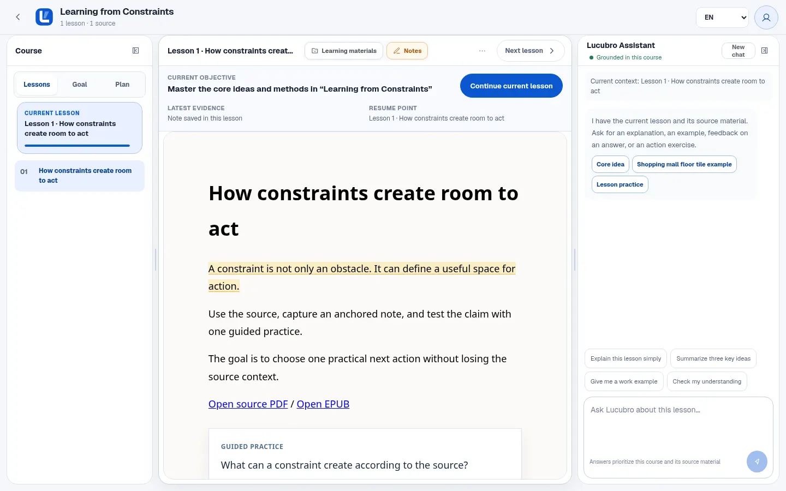
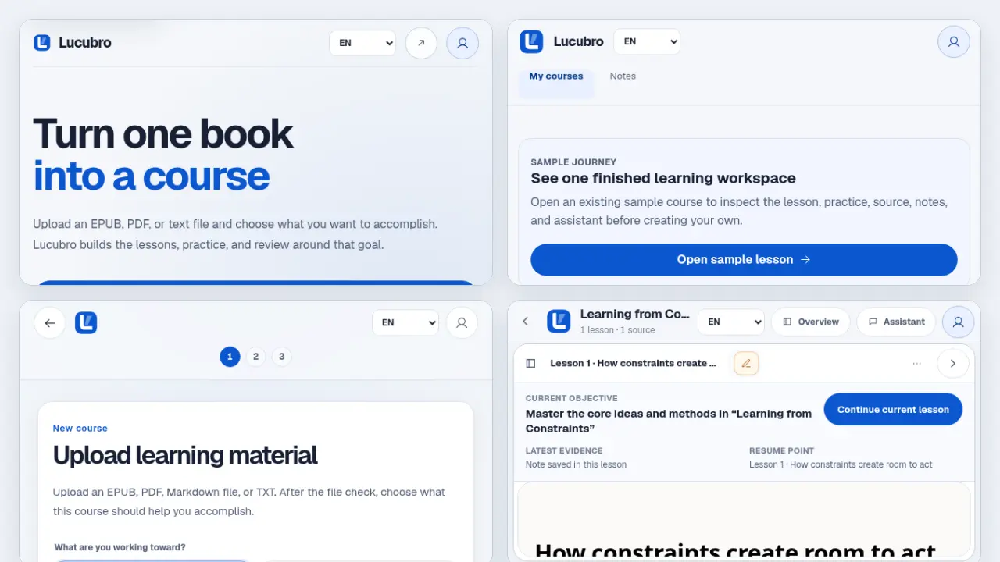
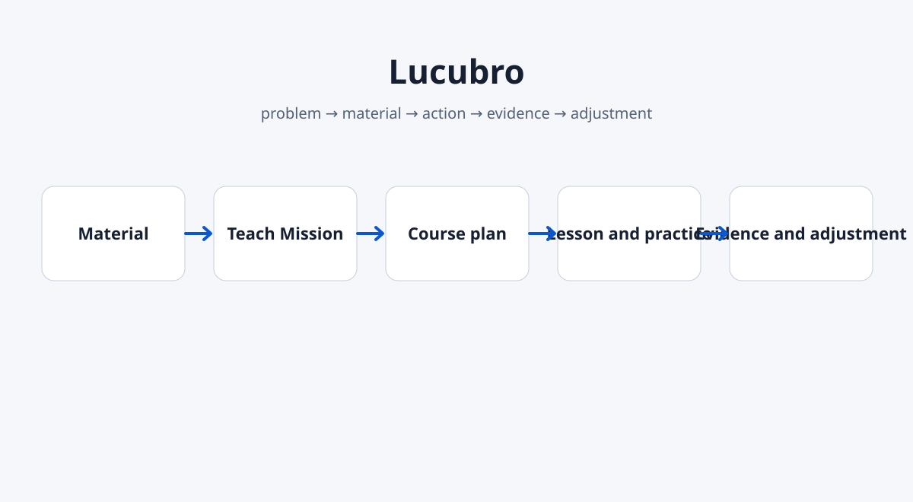
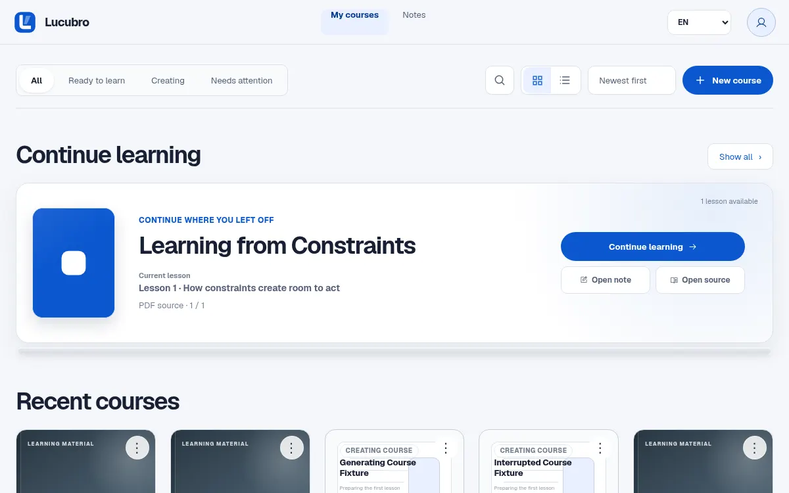
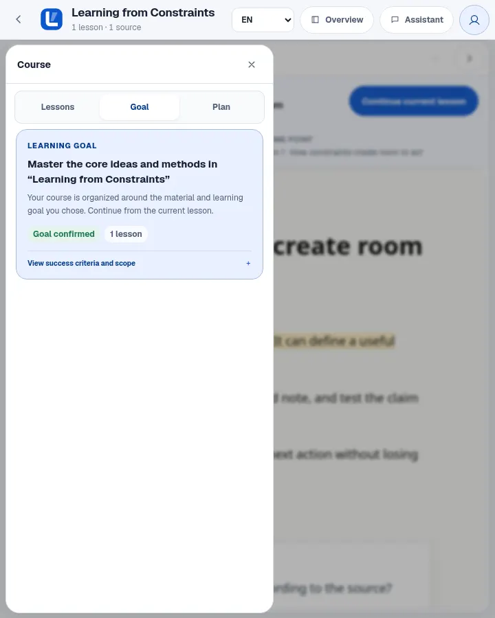
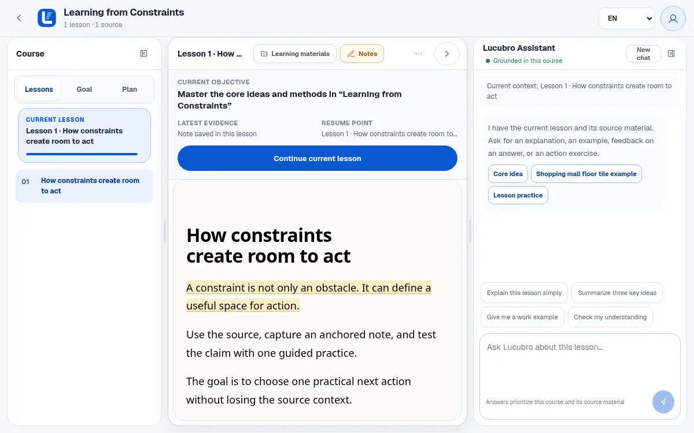
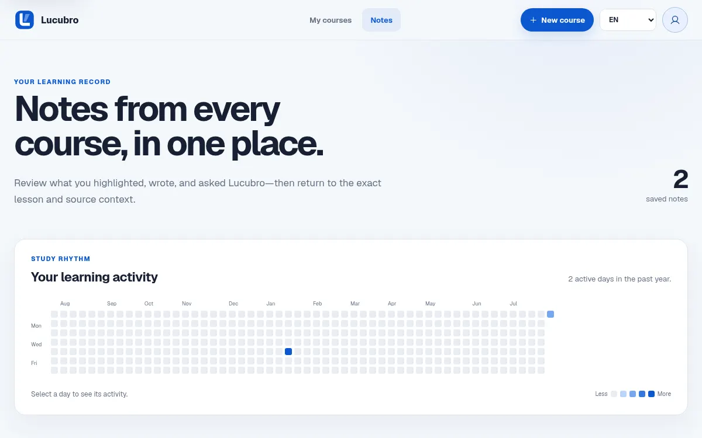

<div align="center">
  

# Lucubro

**Turn material you already have into a course built around what you need to do.**

[简体中文](README.zh-CN.md) · [日本語](README.ja.md)<br>
[Try the sample](#try-the-sample)

[](https://github.com/Sebastianhayashi/lucubro/actions/workflows/ci.yml)
[](package.json)
[](LICENSE)
</div>

<!-- section:hero -->



Lucubro turns books, textbooks, articles, past papers, and your own documents into a local learning workspace. You choose the outcome. Lucubro organizes the source into a mission, course path, interactive lessons, practice, notes, source-grounded help, and a durable learning record.

<!-- section:journey -->

## A 90-second journey



1. Upload EPUB, PDF, Markdown, or plain text.
2. Confirm what you need to accomplish with the material.
3. Open the first lesson and complete a real practice action.
4. Keep notes, source context, feedback, and the exact resume point together.

The loop is simple:

```text
problem → material → action → evidence → adjustment
```

<!-- section:difference -->

## Why Lucubro is different

Lucubro is a learning workspace, not another empty chat window. The course page keeps the goal and outline on the left, the current lesson and practice in the center, and source-grounded assistance on the right. A current-learning strip shows the objective, one next action, the latest evidence, and the exact resume point without creating a second progress model.

<!-- section:sample -->

## Try the sample

```bash
git clone https://github.com/Sebastianhayashi/lucubro.git
cd lucubro
npm ci
npm run demo:seed
LUCUBRO_DATA_DIR=tests/.runtime/courses PORT=3107 npm start
```

Open `http://localhost:3107/app?sample=1`. The seeded workspace is isolated from `data/courses` and does not require a model call.

<!-- section:how -->

## How it works



Lucubro extracts the source structure, confirms a Teach Mission, generates one validated lesson at a time, and records notes and practice attempts as evidence. Generation failures keep the uploaded material and confirmed goal available for recovery.

Read [Product](docs/PRODUCT.md), [Workflow](docs/WORKFLOW.md), and [Architecture](docs/ARCHITECTURE.md) for the full model.

<!-- section:surfaces -->

## Product surfaces

| Surface | What it proves |
| --- | --- |
|  | You can resume the exact course and lesson you left. |
|  | The course stays tied to a visible outcome and source. |
|  | Learning requires an action and visible feedback. |
|  | Notes and original material remain available in context. |

<!-- section:limits -->

## Local data and current limits

Lucubro is an experimental open-source product, not a hosted SaaS.

- Course data is stored locally in the configured data directory.
- The `kimi` CLI is the current local generation runtime and must be installed and authenticated for real generation.
- Production accounts, multi-user permissions, billing, cloud queues, and horizontal scaling are outside the current scope.
- Generation is non-deterministic and protected by structural validation, quality gates, and browser journeys.
- PDF and EPUB compatibility still needs a broader real-world document matrix.

See [Limitations](docs/LIMITATIONS.md) before evaluating deployment.

<!-- section:quality -->

## Architecture and quality

```bash
npm run check
npm test
npx playwright test
npm run verify:readme
```

The repository includes Node contract tests and Playwright journeys for landing, library, onboarding, generation states, course workspaces, notes, source reading, mobile drawers, state consistency, reduced motion, and critical-route accessibility. See [Quality](docs/QUALITY.md) and [Baseline](docs/BASELINE.md).

<!-- section:governance -->

## Contributing, security, and license

Useful contributions include source-format fixtures, accessibility and mobile improvements, learning-evidence experiments, note and source-reader regressions, and usability research tied to real outcomes.

Read [Contributing](CONTRIBUTING.md) and [Security](SECURITY.md). Code is available under the [ISC License](LICENSE). Third-party work is listed in [THIRD_PARTY_NOTICES.md](THIRD_PARTY_NOTICES.md).
