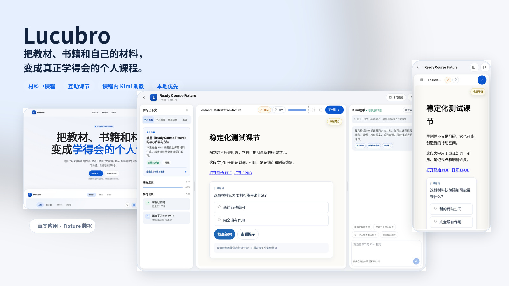
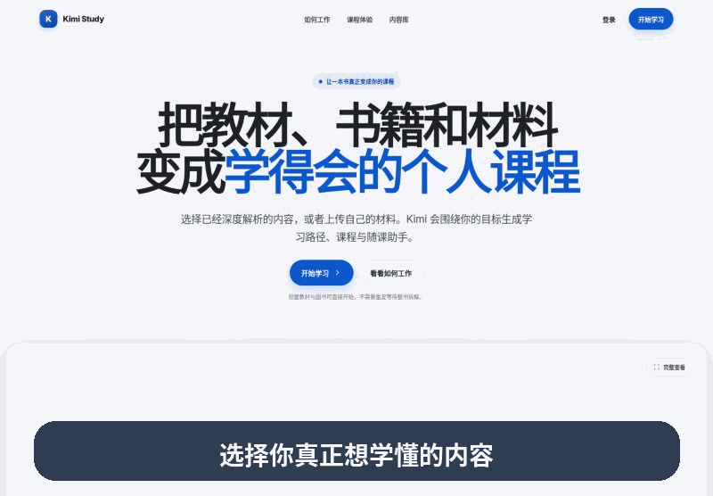
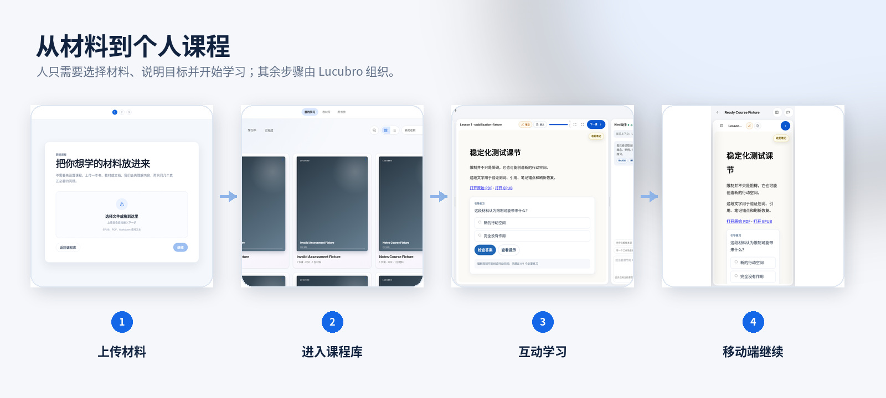
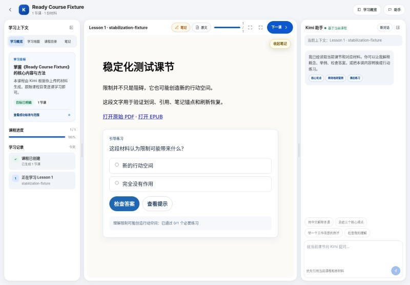
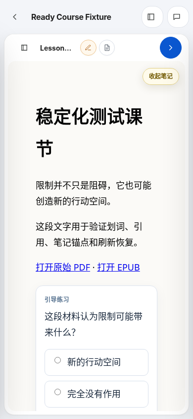
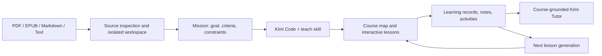
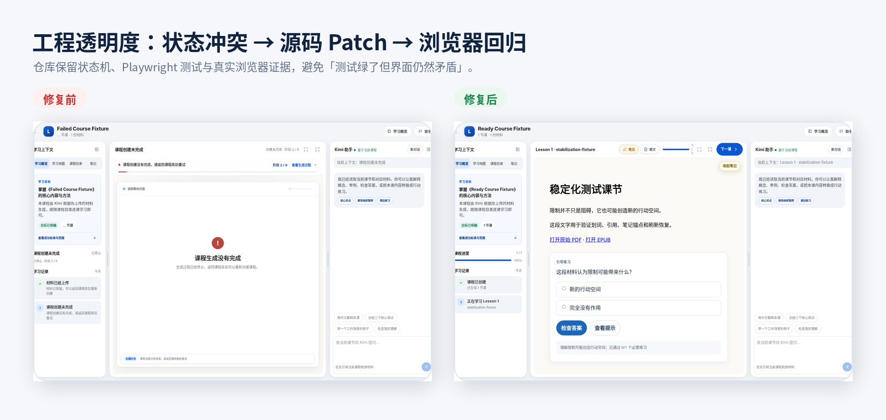

<div align="center">

# Kimi Study

**Turn books and learning materials into personalized courses you can actually study.**

Upload a PDF, EPUB, Markdown file, or plain text. Kimi Code inspects the material in a local workspace, generates interactive lessons, and provides a course-grounded tutor inside the learning workspace.

[简体中文](README.zh-CN.md) · [See the product](#see-the-product-first) · [Quick start](#quick-start) · [Product model](docs/PRODUCT.md) · [Architecture](docs/ARCHITECTURE.md) · [Roadmap](docs/ROADMAP.md)

[](https://github.com/Sebastianhayashi/kimi-study-app/actions/workflows/ci.yml)
[](package.json)
[](tests/e2e)
[](LICENSE)

</div>



## See the product first

Kimi Study is not a document summarizer. It reorganizes source material into a **studyable path** with goals, lessons, practice, notes, evidence, and a tutor that stays grounded in the current course.

- **Material to course**: create a Mission, course map, lessons, and assessments from the source and learning goal.
- **Interactive lessons**: read, answer, request hints, retry, and record mastery in the same learning surface.
- **Course-grounded tutor**: Kimi receives the current Mission, lesson, source context, notes, and learning record.
- **Source access**: return to the original PDF, EPUB, Markdown, text, HTML, or image resources.
- **Continuous learning**: lessons, notes, chat, activities, and next-lesson generation stay attached to one course workspace.



## The 30-second workflow



```text
Choose or upload material
→ inspect the source and clarify the learning goal
→ generate a Mission, learning map, and first lesson
→ read, practise, and take anchored notes
→ ask Kimi in the context of the current course
→ generate the next lesson from the learning record
```

### The learning workspace

The desktop course view uses three coordinated regions: goals, maps, lessons, and records on the left; the active lesson in the center; and the course-grounded Kimi tutor on the right.

<p align="center">
  
  
</p>

## The problem it addresses

| Common study experience | Kimi Study approach |
|---|---|
| A summary with no next action | Goals, sequence, lessons, practice, and next-lesson generation |
| A generic chatbot detached from the source | Tutor context includes the Mission, lesson, source, notes, and mastery |
| “Complete” in one region while another still says “running” | Explicit state machines, one primary progress surface, and terminal-state regression tests |
| Practice that only reveals an answer | Misconceptions, hints, retry, transfer evidence, and mastery records |
| An opaque generation spinner | Current state, real event history, and progress derived from backend artifacts |

## Durable course artifacts

Each course is a file-backed workspace rather than a disposable chat response:

```text
data/courses/<course-id>/
├── original source
├── MISSION.md
├── map.json
├── lessons/
├── assessments/
├── notes.json
├── activity-state.json
├── tutor-state.json
└── generation events / status
```

## How it works



Read [Product model](docs/PRODUCT.md), [Workflow](docs/WORKFLOW.md), and [Architecture](docs/ARCHITECTURE.md) for the detailed contracts.

## Quick start

### Prerequisites

- Node.js 22+
- The [`kimi` CLI](https://github.com/MoonshotAI/kimi-cli), installed and authenticated:

```bash
kimi login
```

### Run with real course generation

```bash
git clone https://github.com/Sebastianhayashi/kimi-study-app.git
cd kimi-study-app
npm ci
npm start
```

Open `http://localhost:3000`.

### Explore deterministic fixtures without a real model call

```bash
npm ci
npm run demo:seed
KIMI_STUDY_DATA_DIR=tests/.runtime/courses PORT=3107 npm start
```

Open `http://localhost:3107/app`. Fixture data is isolated from production `data/courses` and includes ready, generating, failed, notes, and invalid-assessment scenarios.

## Supported scope

**Sources:** PDF, EPUB, Markdown, UTF-8 text, and controlled HTML/image resources inside a course workspace.

**Learning surfaces:** Mission and course map, interactive lessons, selection-to-tutor context, anchored notes, study cards, hints and retry, source viewer, persistent tutor sessions, next-lesson generation, desktop workspace, and mobile drawers.

## Engineering quality

The repository treats UX as explicit state machines, not merely a set of clickable pages:

- `116` Node tests cover generation state, assessment quality, tutor context, next-lesson transactions, and runtime safety.
- Playwright covers the landing page, library, upload, ready/failed/generating courses, mobile drawers, and state coherence.
- CI runs syntax checks, unit tests, Chromium E2E, and guards the production course directory from test writes.
- Failed generation must move the header, sidebar, main canvas, and tutor context into the same terminal state, with only one workflow-primary progress bar.



```bash
npm run check
npm test
npm run fixtures:build
KIMI_STUDY_DATA_DIR=tests/.runtime/courses npm run fixtures:seed -- --clean
npm run test:e2e:ci
```

See [Quality and testing](docs/QUALITY.md), [`docs/stabilization`](docs/stabilization/README.md), and the published [English UX E2E report](docs/reports/kimi-study-ux-e2e-report.en-US.pdf) / [中文 UX E2E 报告](docs/reports/kimi-study-ux-e2e-report.zh-CN.pdf). Historical reports demonstrate the evidence standard; current CI remains the source of truth for the current commit.

## Project status

Kimi Study is an **experimental open-source prototype** for local exploration and product research, not a finished production SaaS.

- Model calls require the user's authenticated Kimi CLI.
- Course artifacts are stored locally, while model requests are performed through the Kimi CLI and its configured service.
- Production identity, multi-tenant permissions, billing, cloud queues, and horizontal scaling are out of scope.
- Real-world PDF/EPUB compatibility still needs a larger file matrix and cross-browser validation.
- Model output is non-deterministic; publication relies on structural validation and quality gates rather than identical generations.

Read [Limitations](docs/LIMITATIONS.md) and [Roadmap](docs/ROADMAP.md).

## Repository map

```text
public/                    pages and browser runtimes
server.js                  HTTP API, course workspaces, Kimi processes
lib/                       state, generation, assessment, and safety logic
skills/teach/              course-generation skill
skills/humanizer-zh/       Chinese tutor-expression skill
data/courses/              local course workspaces; never commit user data
test/                      Node unit and contract tests
tests/e2e/                 Playwright user journeys
scripts/                   fixtures and stabilization tools
docs/                      product, architecture, quality, and state machines
```

## Contributing

Contributions are especially useful for source-format fixtures, state-machine and accessibility improvements, mobile behavior, tutor and notes regression tests, and usability research based on real learning goals.

Read [CONTRIBUTING.md](CONTRIBUTING.md). Report security issues through [SECURITY.md](SECURITY.md).

## License and naming

Code is available under the [ISC License](LICENSE). Adapted third-party work is listed in [THIRD_PARTY_NOTICES.md](THIRD_PARTY_NOTICES.md).

Kimi Study is an independent open-source experiment and is not an official Moonshot AI product. Kimi-related trademarks belong to their respective owners.
