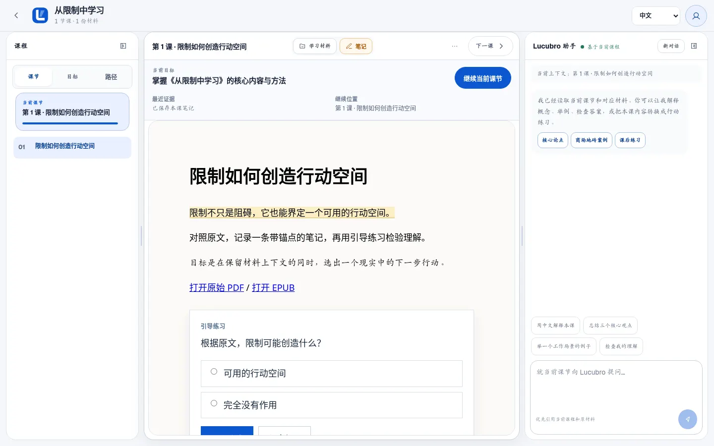
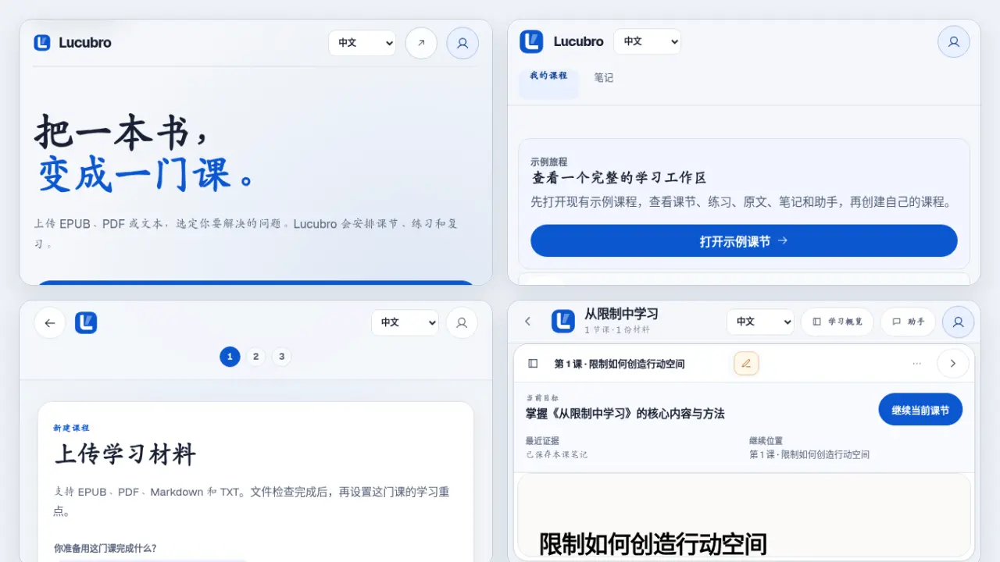
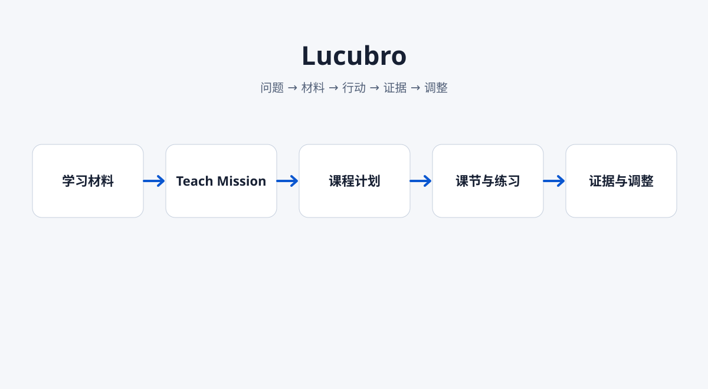
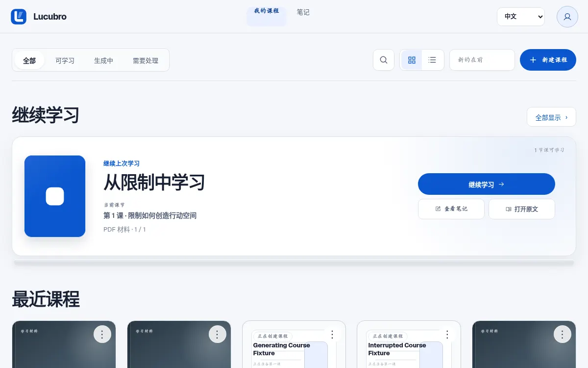
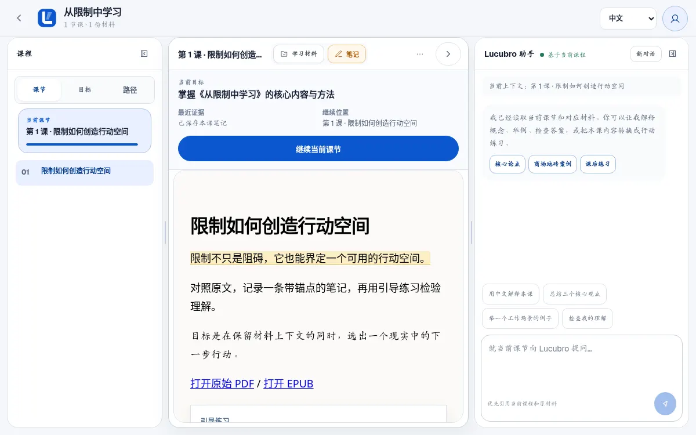
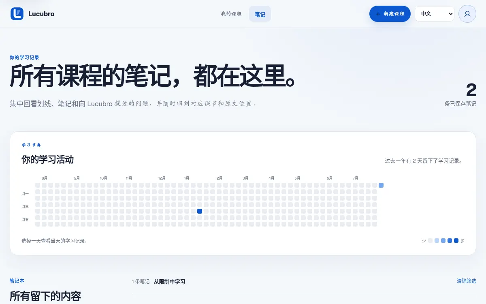

<div align="center">
  

# Lucubro

**把你已有的材料，变成围绕真实任务展开的课程。**

[English](README.md) · [日本語](README.ja.md)<br>
[体验示例](#体验示例)

[](https://github.com/Sebastianhayashi/lucubro/actions/workflows/ci.yml)
[](package.json)
[](LICENSE)
</div>

<!-- section:hero -->



Lucubro 会把书籍、教材、文章、试卷和你自己的文档整理成本地学习工作区。你先确定要完成的结果，Lucubro 再把材料组织成 Teach Mission、课程路径、互动课节、练习、笔记、基于原文的帮助和可持续的学习记录。

<!-- section:journey -->

## 90 秒了解完整旅程



1. 上传 EPUB、PDF、Markdown 或纯文本。
2. 确认你准备利用材料完成什么。
3. 打开第一课，完成一个真实练习动作。
4. 把笔记、原文、反馈和准确的继续位置留在同一工作区。

核心循环是：

```text
问题 → 材料 → 行动 → 证据 → 调整
```

<!-- section:difference -->

## Lucubro 有什么不同

Lucubro 是学习工作区，不是一个空白聊天窗口。课程页左侧保留目标和目录，中间承载当前课节与练习，右侧提供基于材料的帮助。顶部的当前学习条只展示目标、一个下一动作、最近证据和准确继续位置，不会制造第二套进度模型。

<!-- section:sample -->

## 体验示例

```bash
git clone https://github.com/Sebastianhayashi/lucubro.git
cd lucubro
npm ci
npm run demo:seed
LUCUBRO_DATA_DIR=tests/.runtime/courses PORT=3107 npm start
```

打开 `http://localhost:3107/app?sample=1`。示例工作区与 `data/courses` 隔离，不需要模型调用。

<!-- section:how -->

## 工作原理



Lucubro 先提取材料结构，再确认 Teach Mission，然后逐课生成并验证内容，同时把笔记和练习尝试记录成学习证据。生成失败不会丢失已上传材料和已确认目标。

完整说明见[产品](docs/PRODUCT.md)、[工作流](docs/WORKFLOW.md)和[架构](docs/ARCHITECTURE.md)。

<!-- section:surfaces -->

## 产品界面

| 界面 | 它证明什么 |
| --- | --- |
|  | 可以准确返回上次离开的课程和课节。 |
|  | 课程始终绑定可见目标和材料。 |
|  | 学习要求行动，并给出清楚反馈。 |
|  | 笔记和原始材料始终留在上下文中。 |

<!-- section:limits -->

## 本地数据与当前限制

Lucubro 是实验性开源产品，不是托管 SaaS。

- 课程数据保存在配置的数据目录中。
- 真实生成目前依赖已经安装并完成认证的 `kimi` CLI。
- 生产账户、多用户权限、计费、云队列和横向扩展不在当前范围。
- 生成具有非确定性，仓库通过结构验证、质量门禁和浏览器旅程保护结果。
- PDF 和 EPUB 仍需要更广泛的真实文件兼容矩阵。

评估部署前请阅读[限制](docs/LIMITATIONS.md)。

<!-- section:quality -->

## 架构与质量

```bash
npm run check
npm test
npx playwright test
npm run verify:readme
```

仓库包含 Node 契约测试和 Playwright 旅程，覆盖落地页、课程库、建课、生成状态、课程工作区、笔记、原文阅读、移动抽屉、状态一致性、reduced motion 和关键路由可访问性。详见[质量](docs/QUALITY.md)与[性能基线](docs/BASELINE.md)。

<!-- section:governance -->

## 贡献、安全与许可证

适合贡献的方向包括真实材料 fixture、可访问性与移动端改进、学习证据实验、笔记和原文阅读回归测试，以及围绕真实结果开展的可用性研究。

请阅读[贡献指南](CONTRIBUTING.md)和[安全说明](SECURITY.md)。代码采用 [ISC License](LICENSE)，第三方工作见 [THIRD_PARTY_NOTICES.md](THIRD_PARTY_NOTICES.md)。
