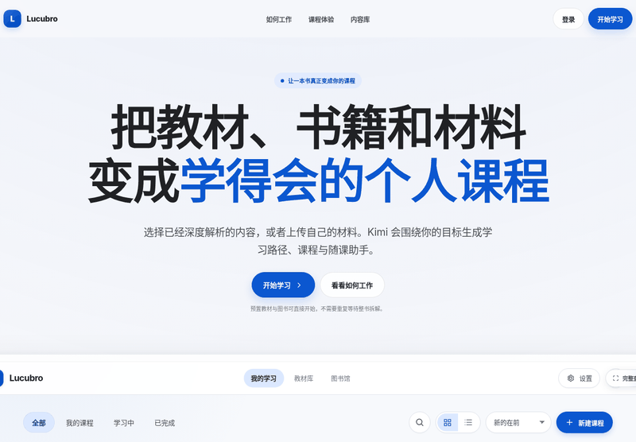
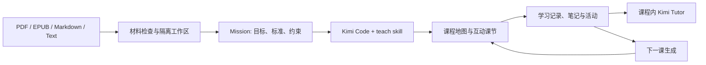

<div align="center">

# Lucubro

**把教材、书籍和自己的材料，变成真正学得会的个人课程。**

上传 PDF、EPUB、Markdown 或文本，Kimi Code 在本地工作区中理解材料、生成互动课节，并在课程页提供绑定当前内容的学习助教。

[English](README.md) · [30 秒看产品](#30-秒看产品) · [快速启动](#快速启动) · [产品原理](docs/PRODUCT.md) · [架构](docs/ARCHITECTURE.md) · [路线图](docs/ROADMAP.md)

[](https://github.com/Sebastianhayashi/lucubro/actions/workflows/ci.yml)
[](package.json)
[](tests/e2e)
[](LICENSE)

</div>


## 先看它能做出什么

Lucubro 不是“把书总结一下”。它试图把一份材料重新组织成一条**可以学习、练习、追问和继续推进**的个人课程路径：

- **材料变课程**：从原书和学习目标生成 Mission、课程地图、课节和练习。
- **互动课节**：正文、引导问题、检查理解、提示、重试和掌握记录在同一学习面中完成。
- **课程内助教**：Kimi 优先依据当前课节、原始材料、笔记与学习记录回答。
- **来源可回看**：课程中可以返回 PDF、EPUB、Markdown、文本或 HTML 原始材料。
- **学习可延续**：课节、笔记、聊天、活动与下一课生成都绑定到同一课程工作区。



## 30 秒看产品


```text
选择或上传材料
→ 检查材料并明确学习目标
→ 生成 Mission、学习地图和第一课
→ 在互动课节中阅读、练习、记笔记
→ 结合当前课程向 Kimi 追问
→ 根据学习记录继续生成下一课
```

### 课程工作区

课程页使用三栏结构：左侧是目标、地图、目录和学习记录，中间是当前课节，右侧是绑定当前课程的 Kimi 助教。

<p align="center">
  
  
</p>

## 它解决什么问题

| 常见学习工具 | Lucubro 的处理方式 |
|---|---|
| 只生成摘要，读完后不知道下一步做什么 | 生成目标、顺序、课节、练习和下一课 |
| 聊天助手脱离当前材料，容易给出泛化回答 | Tutor 上下文绑定 Mission、当前课节、原始材料、笔记和掌握情况 |
| 页面显示“完成”，但其他区域仍显示“生成中” | 使用显式状态机、单一主进度面和终态一致性回归测试 |
| 练习只有答案，没有学习诊断 | 支持误区、提示、重试、迁移证据和掌握记录 |
| 上传后的生成过程不可解释 | 提供当前状态、真实事件历史和由后端产物推导的进度 |

## 核心产物

每门课程保存在独立的文件工作区中：

```text
data/courses/<course-id>/
├── 原始材料
├── MISSION.md
├── map.json
├── lessons/
│   ├── 01-*.html
│   └── ...
├── assessments/
├── notes.json
├── activity-state.json
├── tutor-state.json
└── generation events / status
```

这意味着课程不是一次性的聊天结果，而是一组可以检查、继续生成和恢复的学习产物。

## 工作原理



详细说明见 [产品原理](docs/PRODUCT.md)、[用户工作流](docs/WORKFLOW.md) 和 [技术架构](docs/ARCHITECTURE.md)。

## 快速启动

### 前置条件

- Node.js 22+
- 已安装并登录 [`kimi` CLI](https://github.com/MoonshotAI/kimi-cli)：

```bash
kimi login
```

### 启动真实课程生成

```bash
git clone https://github.com/Sebastianhayashi/lucubro.git
cd lucubro
npm ci
npm start
```

打开 `http://localhost:3000`。

### 不调用真实模型，先看固定演示数据

```bash
npm ci
npm run demo:seed
LUCUBRO_DATA_DIR=tests/.runtime/courses PORT=3107 npm start
```

打开 `http://localhost:3107/app`。Fixture 数据与生产 `data/courses` 隔离，适合查看 ready、generating、failed、notes 和 invalid-assessment 等状态。

## 支持范围

### 材料

- PDF
- EPUB
- Markdown
- TXT / UTF-8 文本
- 课程工作区中的受控 HTML 和图片资源

### 学习能力

- Mission 与学习地图
- 互动课节和质量门禁
- 划词问助手
- 锚定原文的课内笔记
- 学习卡片、提示、重试和掌握记录
- 原始材料阅读器
- 连续 Tutor 会话
- 下一课生成
- 桌面三栏工作区与移动抽屉

## 工程质量

仓库把用户体验视为一组显式状态机，而不只是一组可点击页面：

- `116` 个 Node 测试覆盖生成状态、评估质量、Tutor 上下文、下一课事务、运行时安全等逻辑。
- Playwright 覆盖 landing、课程库、上传、ready/failed/generating 课程、移动抽屉和状态一致性。
- CI 会检查静态语法、单元测试、Chromium E2E，并防止测试写入生产课程目录。
- 生成失败时，页头、侧栏、主工作区和 Tutor 上下文必须同时进入终态；同一工作流只保留一个主进度条。


测试命令：

```bash
npm run check
npm test
npm run fixtures:build
LUCUBRO_DATA_DIR=tests/.runtime/courses npm run fixtures:seed -- --clean
npm run test:e2e:ci
```

更多内容见 [质量与测试](docs/QUALITY.md)、[`docs/stabilization`](docs/stabilization/README.md)，以及本次公开的 [中文 UX E2E 报告](docs/reports/kimi-study-ux-e2e-report.zh-CN.pdf) / [English UX E2E report](docs/reports/kimi-study-ux-e2e-report.en-US.pdf)。历史报告用于展示证据标准；当前提交仍以当前 CI 为准。

## 当前状态

Lucubro 目前是一个**研究型开源原型**，适合本地实验、产品探索和贡献开发，不应直接当作已完成的生产 SaaS：

- 模型调用依赖用户自己的 Kimi CLI 登录状态。
- 课程数据保存在本地文件系统，但模型请求会通过 Kimi CLI 调用对应服务。
- 生产级账号、多人权限、支付、云端队列和横向扩展不在当前范围内。
- PDF/EPUB 的真实兼容性仍需要更大的文件矩阵和跨浏览器验证。
- 模型输出具有非确定性，发布路径使用结构验证与质量门禁，而不是假设每次输出相同。

查看 [已知限制](docs/LIMITATIONS.md) 和 [路线图](docs/ROADMAP.md)。

## 仓库结构

```text
public/                    前端页面与浏览器运行时
server.js                  HTTP API、课程工作区与 Kimi 子进程
lib/                       状态、生成、评估和安全领域逻辑
skills/teach/              课程生成 skill
skills/humanizer-zh/       Tutor 中文表达 skill
data/courses/              本地课程工作区（不提交真实用户数据）
test/                      Node 单元与契约测试
tests/e2e/                 Playwright 用户旅程
scripts/                   Fixture 与稳定性工具
docs/                      产品、架构、质量和状态机文档
```

## 贡献

欢迎提交：

- 可复现的 PDF/EPUB 兼容性问题；
- 新的课程与评估 Fixture；
- 状态机、可访问性和移动端改进；
- Tutor、笔记、互动活动与学习诊断的回归测试；
- 面向真实学习目标的可用性研究。

请先阅读 [CONTRIBUTING.md](CONTRIBUTING.md)。安全问题请遵循 [SECURITY.md](SECURITY.md)。

## 许可证与说明

代码使用 [ISC License](LICENSE)。第三方改编与许可见 [THIRD_PARTY_NOTICES.md](THIRD_PARTY_NOTICES.md)。

Lucubro 是独立的开源实验项目，不是 Moonshot AI 的官方产品；“Kimi”相关商标归其权利人所有。
