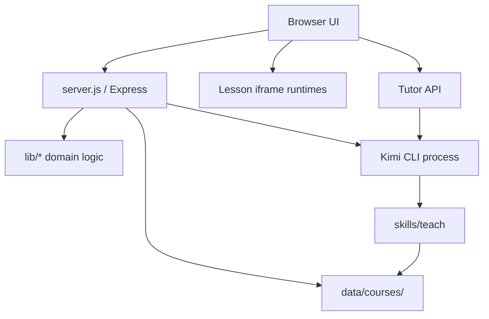

# 技术架构

## 总览

Lucubro 使用一个 Node.js 服务连接静态产品界面、本地文件工作区、Kimi CLI 子进程和浏览器运行时。

## 前端

### `public/index.html`

产品落地页和入口。

### `public/app.html`

课程库、上传、新建课程、筛选、归档和删除。

### `public/new-course.html`

材料上传与首轮 onboarding。

### `public/course.html`

三栏课程工作区。`public/glue.js` 负责把冻结的页面原型连接到真实 API、生成状态、课节、Tutor 和资源阅读器。

### 浏览器运行时

- `generation-preview-product.js`：生成画布、阶段与事件历史；
- `source-viewer.js`：PDF、EPUB、文本和 HTML 阅读；
- `activity-runtime.js`：互动活动；
- `margin-notes*.js`：锚定课文的笔记；
- `study-cards.js`：学习卡片；
- `contextual-actions.js`：划词后的上下文动作；
- `lesson-shell.js`、`lesson-scroll-policy.js`：课节运行边界和滚动策略。

## 后端

`server.js` 提供：

- 静态页面与课程路由；
- 上传与 onboarding；
- 课程状态、事件与课节 API；
- Tutor 请求；
- 下一课生成；
- 受控课程资源读取；
- Kimi CLI 子进程生命周期。

领域逻辑位于 `lib/`：

- `generation-status.js`：从真实作业和产物推导公共状态；
- `generation-events.js`：持久事件和订阅；
- `kimi-generation-runner.js`：Kimi CLI Wire/stream-json 运行；
- `lesson-publish-validator.js`：课节与评估发布验证；
- `assessment-quality-gate.js`：评估质量门禁；
- `next-lesson*.js`：下一课预检、事务与恢复；
- `tutor-context.js`：有界 Tutor 上下文；
- `runtime-config.js`：生产与测试数据隔离。

## 文件工作区

每门课程拥有独立目录。服务端只公开明确允许的学习资源，私有状态、评估答案和事务基线不会通过通用文件路由暴露。

测试使用 `LUCUBRO_DATA_DIR` 指向临时目录，并拒绝生产端口与生产课程目录组合。

## Kimi 与 Skills

- `skills/teach/` 负责把材料和 Mission 生成课程产物；
- `skills/humanizer-zh/` 只用于 Tutor 会话的中文表达约束；
- Kimi session ID 只能来自真实 CLI 输出，不能由应用伪造。

## 状态所有权

同一业务实体必须只有一个规范状态源：

- 后端状态与事件是课程生成事实来源；
- 中央生成预览拥有唯一的工作流主进度条；
- 页头、侧栏和 Tutor 上下文只渲染同一快照的摘要；
- 终止状态优先于迟到的 running 事件。

完整状态机见 [`docs/stabilization/STATE-MACHINES.md`](stabilization/STATE-MACHINES.md)。
