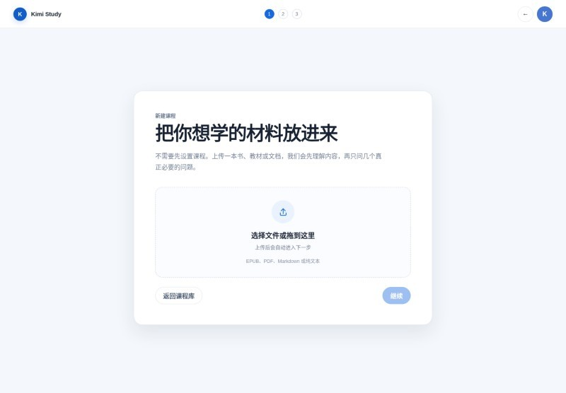
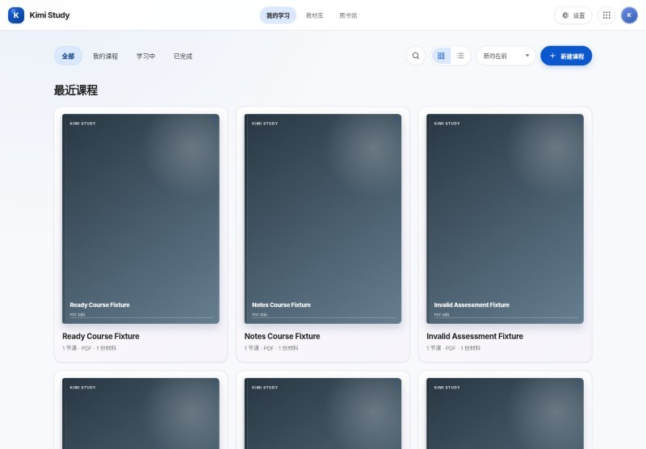

# 演示与截图

## 快速 Fixture 演示

Fixture 演示不调用真实 Kimi 模型，适合查看产品状态和浏览器交互：

```bash
npm ci
npm run demo:seed
KIMI_STUDY_DATA_DIR=tests/.runtime/courses PORT=3107 npm start
```

打开：

- `http://localhost:3107/` - 落地页；
- `http://localhost:3107/app` - 课程库；
- `http://localhost:3107/new-course` - 上传流程；
- `http://localhost:3107/course/readycourse` - 已就绪课程；
- `http://localhost:3107/course/generatingcourse` - 生成中；
- `http://localhost:3107/course/failedcourse` - 失败终态。

## 产品截图

### 落地页


### 上传材料



### 课程库



### 课程工作区


### 移动端


## 截图来源

仓库中的产品截图来自隔离 Fixture 和真实 Chromium 执行。它们展示的是测试数据，不包含真实用户材料。
