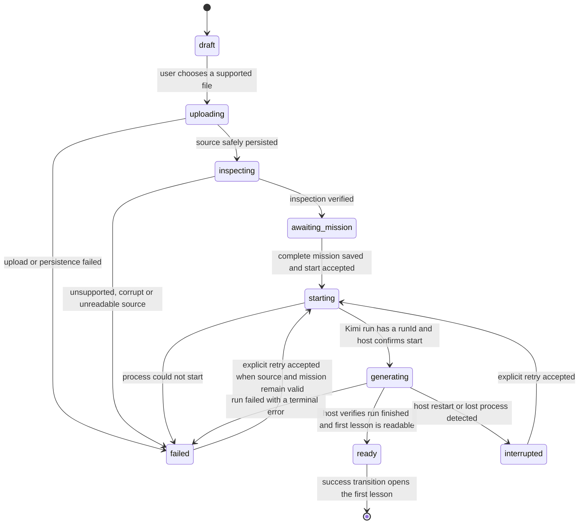

# First-run Onboarding State Machine

Status: **target contract; not implemented**
Repository baseline: `main@e337f94523b891121225fffebd3b06e81ca68591`
Reference animation: `lucubro-first-run-quiet-carousel-demo(1).html`
Reference SHA-256: `48cf40459ed6aa13a0af13a06a0d28190d66aa773cedd91f1d48fd4eee92e742`

This document defines the proposed first-run lifecycle. It deliberately separates current behavior from target behavior. Nothing in this document should be read as proof that onboarding already exists.

## 1. Current behavior at the baseline

At `main@e337f945...`:

- `POST /api/courses` creates an ID with `Date.now().toString(36)`.
- It creates the course directory, moves the upload to `book.<ext>`, writes `meta.json`, immediately starts `runKimi(..., { track: true })`, and returns `{ id }`.
- It does **not** create `onboarding.json`, `MISSION.md`, or `map.json` in the upload route.
- The persisted generation job uses existing stages such as `understanding`, `generating`, `ready`, and `failed`.
- A stale in-memory generation job older than 60 seconds is currently surfaced as `failed`; there is no persisted `interrupted` onboarding state yet.
- Lesson availability is derived from actual lesson files. A job saying `ready` is not sufficient without at least one readable lesson.

## 2. Four independent state dimensions

The implementation must not collapse these into a single `stage` field.

| Dimension | Authority | Purpose |
|---|---|---|
| Onboarding state | `onboarding.json` | Upload, inspection, mission collection, first-run navigation and recovery |
| Generation job state | existing `job.json` helpers | Kimi run lifecycle, run ID, mode, errors and timestamps |
| Lesson availability | actual lesson files and lesson endpoint | Whether a first lesson can be opened |
| Learning state | existing course UI and progress records | Current lesson and learner progress after onboarding |

## 3. Target onboarding states

`interrupted` is a **target onboarding state**. The current baseline converts stale generation to `failed`; Patch A may introduce explicit interruption persistence without changing the existing public generation event vocabulary unnecessarily.

## 4. State definitions

### `draft`

- Written by: onboarding creation logic before a file is accepted, or not persisted until upload begins.
- UI: upload stage.
- Allowed: choose file, cancel, return to `/app`.
- Forbidden: mission submission, Kimi start.
- Resume: `/new-course` shows upload stage.

### `uploading`

- Written by: `POST /api/course-onboarding` after validation begins and before the source is durably moved.
- UI: upload stage with real browser upload progress where available; no invented percentage.
- Allowed: wait, cancel only if the server has not committed the draft.
- Forbidden: mission submission, Kimi start, retry.
- Next: `inspecting` after `book.<ext>` and the initial `onboarding.json` are atomically established.

### `inspecting`

- Written by: server-side source inspection.
- UI: the reference `reading` stage. The reading sweep may loop indefinitely while inspection is genuinely unfinished.
- Allowed: background navigation after a course ID exists; polling `GET /api/courses/:id/onboarding`.
- Forbidden: answering mission questions, starting Kimi.
- Next: `awaiting_mission` only after format-specific checks succeed; otherwise `failed`.

### `awaiting_mission`

- Written by: inspection completion.
- UI: the reference `mission` stage, restoring the first unanswered question after refresh.
- Allowed: save all three enumerated answers, go back between questions, replace the source only by abandoning this draft and creating a new one.
- Forbidden: starting without all required answers.
- Next: `starting` through `POST /api/courses/:id/start` after `PUT /mission` has persisted both `onboarding.json` and deterministic `MISSION.md`.

### `starting`

- Written by: host before launching Kimi.
- UI: loading stage at the current canonical generation progress, initially `0%` if no verified progress exists.
- Allowed: poll status, subscribe to generation events, go to background.
- Forbidden: a second process launch, changing Mission during the active start transaction.
- Next: `generating` after a real `run-start`/run ID; `failed` when process launch fails.

### `generating`

- Written by: host after a real Kimi run starts.
- UI: loading stage driven by existing `/status` and `/generation-events` evidence.
- Allowed: view verified process, background navigation, reconnect after refresh.
- Forbidden: timer-based phase advancement, a second Kimi run, raw chain-of-thought display.
- Next: `ready`, `failed`, or target `interrupted`.

### `ready`

- Written by: host only after all of the following are true:
  1. the Kimi run finishes successfully;
  2. at least one lesson file exists;
  3. the first lesson endpoint can return readable HTML;
  4. onboarding success has not already been consumed for this browser navigation.
- UI: loading progress is fixed to `100%`, then the reference ready stage and its one-shot overlay exit play.
- Allowed: open first lesson, revisit course normally.
- Forbidden: replay onboarding for a completed course, start another first-run job.

### `failed`

- Written by: upload, inspection, Mission persistence, process start, run, or readiness verification failure.
- UI: contextual failure copy with a retry or restart action; animation must stop.
- Allowed: retry only when the source and Mission remain valid; otherwise abandon and upload again.
- Forbidden: endless loading, silently resetting to `draft`.

### `interrupted`

- Written by: target recovery logic when persisted state says an active run exists but no process is present after restart/recovery evaluation.
- UI: explicit interruption message, not a generic quality failure.
- Allowed: explicit retry using the existing source and Mission.
- Forbidden: automatic duplicate process launch on every page load.

## 5. Transition invariants

1. **Mission before generation:** Kimi must not start before all three answers and `MISSION.md` are durably written.
2. **Single active run:** an active course lock or active job makes `POST /start` idempotently return the existing run.
3. **No timer authority:** animation timers may loop visual motion but may not change onboarding state, generation phase, metrics, or readiness.
4. **Host-owned completion:** Kimi cannot self-report terminal `complete`; the host emits completion only after files are verified.
5. **Lesson-backed ready:** `ready` requires a readable lesson, not merely `job.stage === 'ready'`.
6. **Monotonic evidence:** a completed verified generation phase is not demoted by a late stale event from the same run.
7. **Run isolation:** events from old run IDs cannot reset or advance the active run.
8. **Refresh recovery:** every state after source persistence is recoverable from disk plus existing job/lesson evidence.
9. **No duplicate drafts:** repeated clicks are guarded client-side and server-side; idempotency does not depend solely on button disabling.
10. **Existing courses bypass onboarding:** a course with onboarding `ready` and a readable lesson enters `/course/:id` directly.

## 6. Reconciliation after restart or refresh

The server computes a recovery view from four sources: `onboarding.json`, existing job data, active in-memory lock, and lesson files.

| Persisted onboarding | Job/lock/files evidence | Recovery result |
|---|---|---|
| `inspecting` | source exists, inspection incomplete | resume inspection once; do not create a duplicate course |
| `awaiting_mission` | no active job | restore mission question and answers |
| `starting` | active lock or active job | surface `starting`/`generating`; do not launch again |
| `starting` | no lock, no active job, no lesson | `interrupted` or `failed` according to the Patch A recovery policy |
| `generating` | active lock/job | reconnect to status and SSE |
| `generating` | no lock, stale job, no lesson | persist `interrupted` in the target design |
| any active state | readable lesson and verified finished job | reconcile to `ready` |
| `ready` | lesson missing or unreadable | fail readiness verification; never open a blank course |

## 7. UI stage mapping

| Onboarding state | Reference stage | Visual behavior |
|---|---|---|
| `draft`, `uploading` | `data-stage="upload"` | Preserve layout; show only real file/upload information |
| `inspecting` | `data-stage="reading"` | Preserve sweep loop; copy follows real inspection status |
| `awaiting_mission` | `data-stage="mission"` | Preserve question transition motion and restore answers |
| `starting`, `generating` | `data-stage="loading"` | Preserve four visual scenes; map them to verified generation phases |
| `ready` | `data-stage="ready"` | Preserve ready overlay and one-shot exit before navigation |
| `failed`, `interrupted` | loading or mission panel with error treatment | Stop loops that imply ongoing work; provide explicit recovery action |

## 8. Generation phase mapping inside `generating`

The existing generation contract remains authoritative.

| Existing phase | First-run visual | Caption class of meaning |
|---|---|---|
| `extracting` | `orbit` | 理解材料 |
| `profiling` | `orbit` | 梳理结构 |
| `claims` | `cards` | 建立目标 |
| `blueprint` | `cards` | 组织课程 |
| `questions` | `nodes` | 生成练习 |
| `quality` | `scan` | 检查质量 |
| `assembling` | `cards` | 组装课程 |
| `validating` | `scan` | 验证课程 |
| host-confirmed ready | ready stage | 学习区域已准备好 |

When no new event arrives, the current scene may continue looping. It must not rotate to another scene merely to create activity.

## 9. Product decisions fixed for Milestone 1B

These are accepted implementation constraints for the first onboarding milestone:

- Supported formats: PDF, EPUB, Markdown (`.md`/`.markdown`), and TXT.
- Word/DOC/DOCX is not advertised or accepted until a verified parser exists.
- Every mission question is required.
- Existing `POST /api/courses` remains temporarily available as a legacy endpoint; the new first-run UI uses only the onboarding endpoints.
- “在后台继续” never cancels Kimi.
- Failed drafts are not automatically deleted; the user may retry or explicitly delete them from the course list.
- The first-run animation and the frozen in-course Generation Preview never render at the same time.

## 10. Decisions still requiring product approval

The following are intentionally not hard-coded by this contract and must be confirmed before or during Patch A review:

- Whether the maximum source size should be 200 MiB or a lower limit.
- Whether `interrupted` is persisted as a distinct state immediately in Patch A or initially represented as a structured failure code.
- Whether a user may edit Mission after generation has started; the recommended Milestone 1B behavior is “not during an active run”.
- Whether returning from the ready overlay navigates automatically after the overlay transition or waits for the visible “开始第一课” button. The reference copy says automatic open; the recommended behavior is automatic navigation with the button as an immediate accessible alternative.
